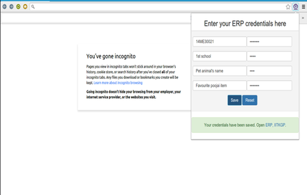
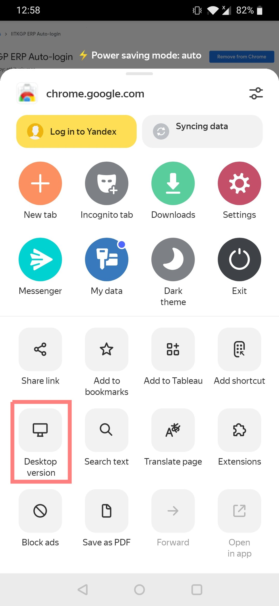
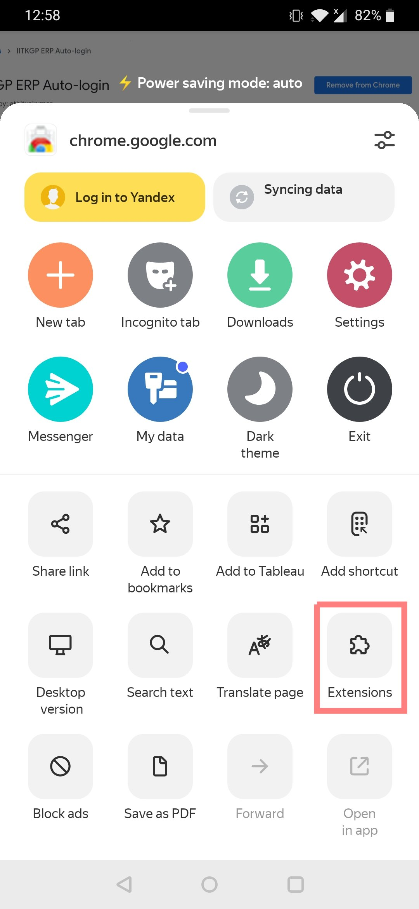
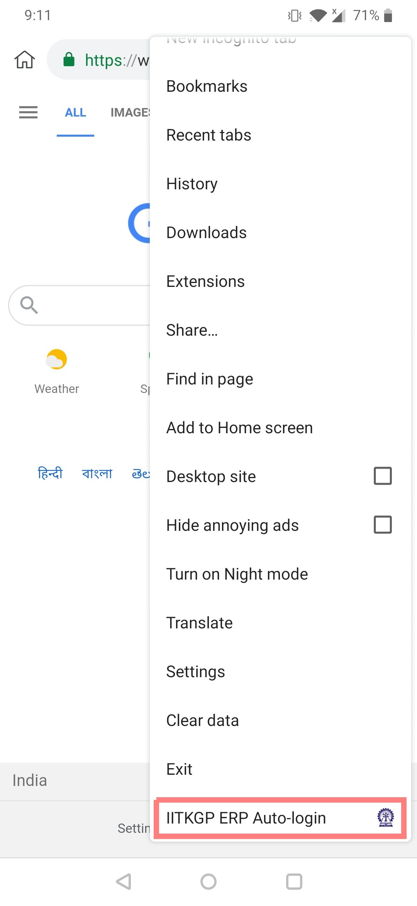

IITKGP ERP AUTO LOGIN
=====================
A chrome extension that has to be set up just one time for automatic login to your IITKGP ERP account every time. Just [install the chrome extension](https://chrome.google.com/webstore/detail/iitkgp-erp-auto-login/gdickphilmdekcbmpjmbnbikchaecbdk), and click on the extension logo (IIT Kharagpur's logo) to set up your login credentials.

## How to add this extension to Firefox

This extension can also be added to Firefox. The steps to follow for the same are:

1. Download the `erp-auto-login_ff.xpi` file.
2. Open Firefox and go to `about:addons` or `Ctrl+Shift+A`.
3. Click on the settings (gear) icon and select `Install Add-on From File`.

      

4. Select the above downloaded file and click open.
5. Give the permissions and you are done.

## How to use this extension on Mobile

Mobile users can also use erp auto login using browsers like **Yandex** and **Kiwi**. The steps to follow for the browsers respectively are:-

- ### Yandex Browser

  1. Download Yandex Browser from Play Store
  2. Head over to [Erp auto login on chrome Web Store](https://chrome.google.com/webstore/detail/iitkgp-erp-auto-login/gdickphilmdekcbmpjmbnbikchaecbdk)
  3. Now click on Desktop version   

      

  4. Now click on **add to chrome** to add the extension
  5. Go to extensions and select erp auto login

      

  6. Enter your details

- ### Kiwi Browser

  1. Download Kiwi Browser from Play Store
  2. Head over to [Erp auto login on chrome Web Store](https://chrome.google.com/webstore/detail/iitkgp-erp-auto-login/gdickphilmdekcbmpjmbnbikchaecbdk)
  3. Now click on **add to chrome** to add the extension
  4. Click on three-dot menu on top right, scroll below and select **erp auto login**

      

  5. Enter your details

## Contributing

Please read [CONTRIBUTING.md](CONTRIBUTING.md) guide to know more.
