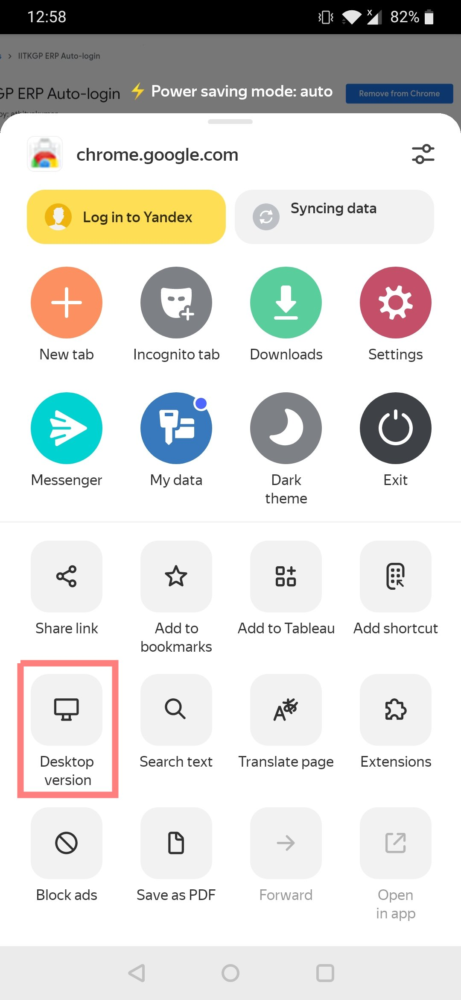
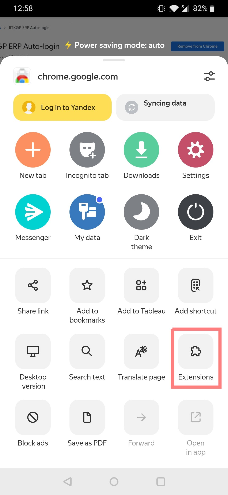
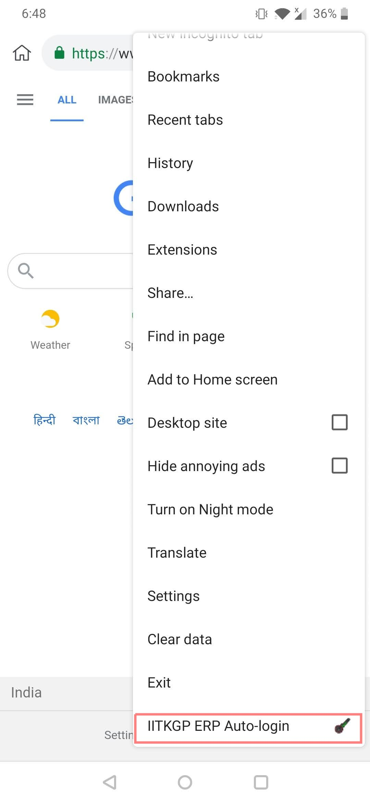

IITKGP ERP AUTO LOGIN
=====================
A browser extension that needs to be set up just one time for automatic login to your IITKGP ERP account every time. Just [install the chrome extension](https://chrome.google.com/webstore/detail/iitkgp-erp-auto-login/gdickphilmdekcbmpjmbnbikchaecbdk) or [install the firefox addon](https://addons.mozilla.org/addon/iitkgp-erp-auto-login/), and click on the extension logo (IIT Kharagpur's logo) to set up your login credentials.

   

**Note:- This is not an official application by IIT Kharagpur. This is the result of hard work and enthusiasm by @athityakumar and is maintained by [Metakgp](https://metakgp.github.io/).**

# Credentials Security

**We don't store your credentials.** This extension uses [localStorage API](https://developer.mozilla.org/en-US/docs/Web/API/Web_Storage_API#localStorage) to store your credentials **on your local machine**. The [path to these credentials](https://stackoverflow.com/questions/8634058/where-the-sessionstorage-and-localstorage-stored) and how they are stored is *browser specific*.

## How to use this extension on Mobile

Mobile users can also use erp auto login using browsers like **Yandex** and **Kiwi**. The steps to follow for the browsers respectively are:-

### Yandex Browser

  1. Download Yandex Browser from the Play Store
  2. Head over to [Erp auto login on chrome Web Store](https://chrome.google.com/webstore/detail/iitkgp-erp-auto-login/gdickphilmdekcbmpjmbnbikchaecbdk)
  3. Now click on Desktop version   

      

  4. Now click on **add to chrome** to add the extension
  5. Go to extensions and select erp auto login

      

  6. Enter your details

### Kiwi Browser

  1. Download Kiwi Browser from Play Store
  2. Head over to [Erp auto login on chrome Web Store](https://chrome.google.com/webstore/detail/iitkgp-erp-auto-login/gdickphilmdekcbmpjmbnbikchaecbdk)
  3. Now click on **add to chrome** to add the extension
  4. Click on three-dot menu on top right, scroll below and select **erp auto login**

      

  5. Enter your details

## Contributing

Please read [CONTRIBUTING.md](CONTRIBUTING.md) guide to know more.
